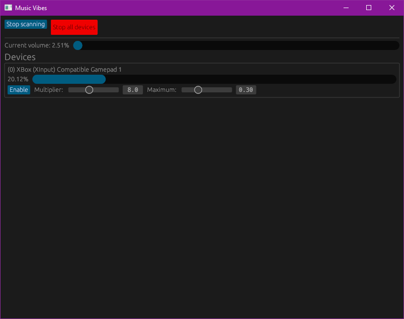

# Music Vibes - vibe with your music

!!! VERY WIP !!!

Turns audio into vibrations, using connected
[`buttplug`](https://buttplug.io/)-compatible hardware

## Caveats

Created mostly to play around with qdot's excellent `buttplug` and my own
`audio-capture` crate.

Features two modes: Tui and Gui with Gui being the default.

Currently, tui can only handle one device, and will panic if there zero, two
or more devices connected.
