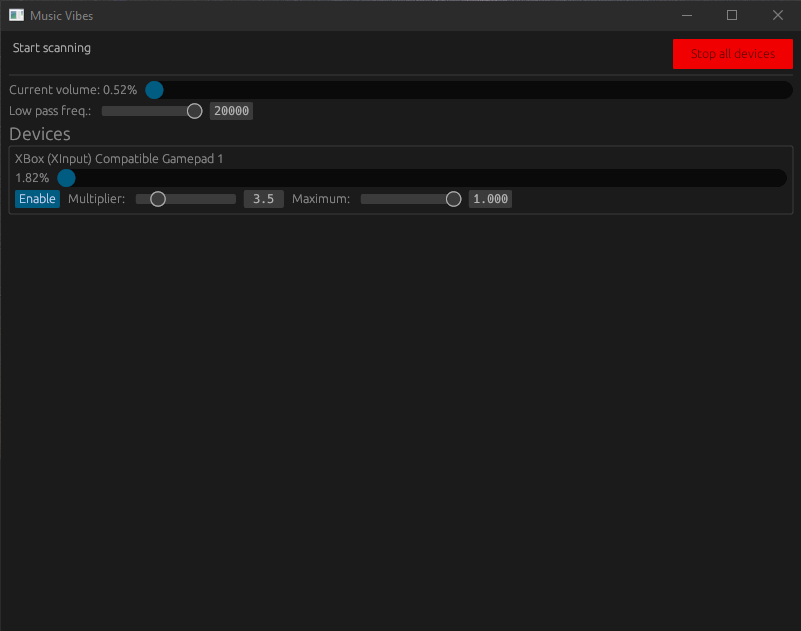

# Music Vibes - vibe with your music

\[WIP] (Windows-only for now) Translates currently playing audio into
vibrations, using connected [`buttplug`](https://buttplug.io/)-compatible
hardware

## Download

Go to https://github.com/Shadlock0133/music-vibes/releases/latest, and download
"music-vibes.exe" from Assets

## Install from source

If you want to compile program manually from source, here are the steps:

0. You will require working Rust toolchain. You can install it by using [rustup](https://rustup.rs/).

1. Clone the repo with `git clone https://github.com/Shadlock0133/music-vibes.git`
or download it clicking in top-right corner `Code` > `Download ZIP`
  
2. Install with `cargo install --path .`

3. (optional) You can also build without installing using `cargo build --release`,
which creates executable at `target/release/music-vibes{.exe}`

## Caveats

Created mostly to play around with qdot's excellent `buttplug` and my own
`audio-capture` crate.

Current implementation of cutoff filter is "sharp", that is, it will jump from
zero to above set `min` value, with no smoothing, so be careful with that.

## Start Up Behavior

When the application starts music-vibes will try to connect to buttplug server such as intiface on localhost. If the connection has a timeout it falls back to creating it's own server. 

You can also specify a different address using the command flag `--server-addr` or `-s`